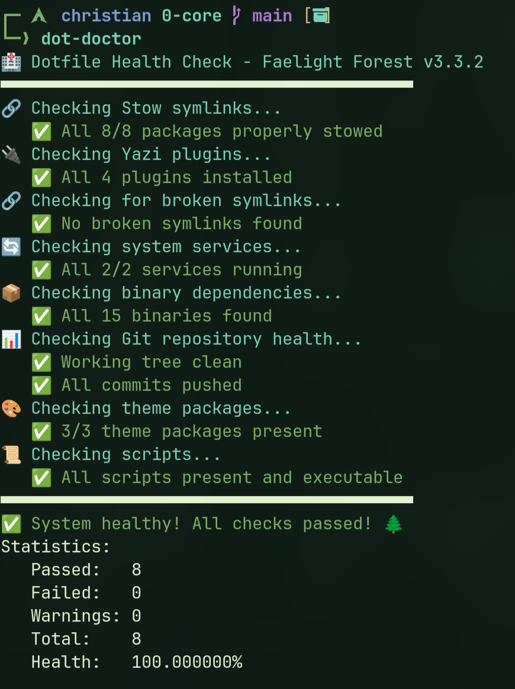
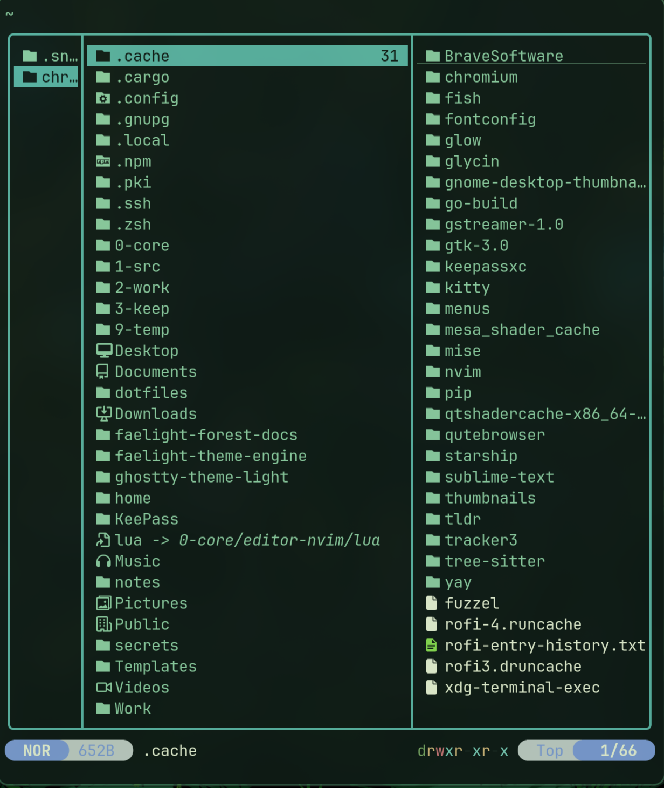

# 🌲 Faelight Forest v3.3.2 - 0-Core Hybrid Architecture

> **From chaos to order. From generic to intentional. From dotfiles to 0-core.**

A revolutionary approach to Linux configuration management built on **numbered priority**, **semantic clarity**, and **manual control**.


> **Migration Note:** Switched from Fish to Zsh in v3.3.2 for better bash compatibility and open source accessibility. Fish config preserved in `archive/shell-fish` branch.

---

## 🎯 **The Philosophy**

**Traditional dotfiles repos:**

- Generic name ("dotfiles" like everyone else)
- Flat structure (everything mixed together)
- Unclear priorities
- Hidden automation surprises

**0-Core Hybrid Architecture:**

- **Numbered hierarchy** (0 = highest priority)
- **Semantic naming** (wm-hypr, shell-zsh, editor-nvim)
- **Immutable protection** (lock-core prevents accidents)
- **Manual control** (YOU decide when things happen)

**Core Principle:** _"Order through intentionality, not automation."_

---

## 🏗️ **The Architecture**

### **Numbered Directory Structure**

```
~/0-core/              🔒 Immutable configuration (this repository)
~/1-src/               📁 Source code & development projects
~/2-work/              💼 Active work & client projects
~/3-keep/              💎 Important files & archives
~/9-temp/              🗑️  Temporary files & scratch space
~/secrets/             🔐 Never committed, maximum security
```

**Why numbered?**

- **Instant priority recognition** (0 is most critical)
- **Muscle memory navigation** (g+0, g+1, g+2 in Yazi)
- **Clear hierarchy** (lower numbers = higher importance)
- **Scalable** (add 4-8 for future categories)

---

### **0-Core Package Structure**

```
0-core/
├── 📦 Window Manager & Desktop
│   ├── wm-hypr/                    Hyprland configuration
│   ├── bar-waybar/                 Status bar
│   ├── notif-mako/                 Notifications
│   └── theme-gtk/                  GTK theming
│
├── 💻 Shell & Terminal
│   ├── shell-zsh/                  Zsh shell configuration
│   ├── prompt-starship/            Starship prompt
│   ├── theme-term-foot-dark/       Foot terminal theme
│   └── theme-term-ghostty-dark/    Ghostty terminal theme
│
├── 🛠️ Development Tools
│   ├── editor-nvim/                Neovim configuration
│   ├── fm-yazi/                    Yazi file manager
│   ├── vcs-git/                    Git configuration
│   └── browser-brave/              Brave browser settings
│
├── 🎨 Launchers & Utilities
│   ├── theme-launch-fuzzel-dark/   Fuzzel launcher theme
│   └── tools-topgrade/             System update configuration
│
├── 📜 Scripts & Automation
│   ├── scripts/
│   │   ├── safe-update             Smart system updater
│   │   ├── core-protect            Immutable lock/unlock
│   │   ├── theme-switch            Theme management
│   │   └── dot-doctor              Health checker
│   │
│   ├── automation/                 Manual-trigger scripts
│   └── hooks/                      Git hooks
│
├── 📚 Documentation
│   ├── docs/
│   │   ├── CHANGELOG-v3.1.md       v3.1 changes
│   │   ├── CHANGELOG-v3.2.md       v3.2 changes
│   │   ├── PASSWORD-SOLUTION.md    Lessons learned
│   │   └── ...
│   │
│   ├── README.md                   This file
│   ├── COMPLETE_GUIDE.md           Comprehensive guide
│   └── VERSION                     3.2.0
│
└── 🔧 System Configuration
    ├── system/                     System-level configs
    ├── packages/                   Package lists
    └── installation/               Install scripts
```

---

## ✨ **Key Features**

### **🔒 Immutable Core Protection**

Prevent accidental configuration changes with filesystem-level protection:

```bash
lock-core              # 🔒 Make 0-core immutable (chattr +i)
unlock-core            # 🔓 Temporarily unlock for editing
edit-core shell-zsh   # 📝 Auto-unlock, edit, re-lock
core-status            # 📊 Check protection state
```

**How it works:**

- Uses Linux `chattr +i` (filesystem immutability)
- Protects against accidental `rm`, `mv`, modifications
- Requires explicit unlock for edits
- Auto-relock after editing

---

## 🐚 Shell Configuration

**Primary Shell: Zsh** (v3.3.2+)

- Professional bash-compatible shell
- Fish-like features via plugins (autosuggestions, syntax highlighting)
- Faelight Forest themed
- Complete .zshrc with 188+ aliases

**Note:** Legacy Fish configuration available in `archive/shell-fish` branch for reference.

### Features:

- 🎨 Faelight Forest color scheme
- ⭐ Starship prompt
- 🔍 zsh-autosuggestions (Fish-like)
- 🎨 zsh-syntax-highlighting (custom colors)
- 📦 188+ aliases and functions
- 🔧 Professional development environment

### **🔄 Smart Update System**

Learn from mistakes. No more boot-time automation disasters.

```bash
safe-update            # Smart system update with auto-recovery
weekly-check           # Manual maintenance prompt (YOU control)
```

**Features:**

- ✅ Auto-detects yay library issues
- ✅ Auto-rebuilds on failure
- ✅ Pre/post snapshots (Btrfs + Snapper)
- ✅ Checks for .pacnew files
- ✅ Post-update health verification
- ✅ **MANUAL-ONLY** (no systemd timers!)

**Lesson learned:** After 12 hours debugging a boot-time systemd timer that broke sudo, we committed to **manual control only**. YOU decide when updates run.

---

### **🚀 Instant Navigation (Yazi Teleports)**

Press `g` + key for instant directory access:

**Top-Level Structure:**

- `g+0` → Core configs (~/0-core)
- `g+1` → Source code (~/1-src)
- `g+2` → Active work (~/2-work)
- `g+3` → Important files (~/3-keep)
- `g+9` → Temporary (~/9-temp)
- `g+s` → Secrets (~/secrets)

**Config Quick Access:**

- `g+h` → Hyprland (wm-hypr)
- `g+f` → Zsh shell (shell-zsh)
- `g+n` → Neovim (editor-nvim)
- `g+w` → Waybar (bar-waybar)
- `g+y` → Yazi config (fm-yazi)
- `g+c` → System config (~/.config)

**One keystroke to anywhere!** 🎯

---

### **🏥 Health Monitoring**

```bash
dot-doctor             # Complete system health check
```

**Validates:**

- ✅ All stow packages properly deployed
- ✅ Yazi plugins installed
- ✅ No broken symlinks
- ✅ System services running
- ✅ Binary dependencies present
- ✅ Git repository health
- ✅ Theme packages present
- ✅ Scripts executable

**Target:** 100% health, always.

## 📸 Screenshots

### Desktop & Terminal


_Hyprland + Waybar + Faelight Forest theme with custom Zsh welcome message_

### Package Management


_Risk-aware package versioning with blast radius indicators (🔴 Critical, 🟠 High, 🔵 Medium, 🟢 Low)_

### System Health


_Automated health monitoring - 100% system integrity verification_

### File Navigation


_Yazi file manager with instant teleports and file preview_

---

### **🔐 Security Hardened (73% Lynis)**

Enterprise-level security for a desktop system:

```
✅ LUKS2 full disk encryption
✅ UFW firewall (configured)
✅ fail2ban intrusion prevention
✅ DNSOverTLS (Quad9)
✅ Mullvad VPN integration
✅ Secure boot practices
✅ Manual-control philosophy (no surprise automation)
```

**73% Lynis score** = Excellent for personal desktop!

---

## 🚀 **Quick Start**

### **Prerequisites**

- Arch Linux (or Arch-based distro)
- Git installed
- Basic terminal familiarity

---

### **Installation**

#### **Step 1: Clone Repository**

```bash
# Clone to 0-core (not "dotfiles"!)
git clone https://github.com/WidkidoneR2/0-core.git ~/0-core
cd ~/0-core
```

#### **Step 2: Install Packages**

```bash
# Install from package list
sudo pacman -S --needed - < packages/pkglist.txt

# Install AUR helper (if not installed)
git clone https://aur.archlinux.org/yay.git
cd yay && makepkg -si
```

#### **Step 3: Setup SSH Keys (Recommended)**

```bash
# Generate SSH key
ssh-keygen -t ed25519 -C "your-email@example.com"

# Add to ssh-agent
eval "$(ssh-agent -s)"
ssh-add ~/.ssh/id_ed25519

# Copy public key
cat ~/.ssh/id_ed25519.pub
# Add to GitHub: https://github.com/settings/keys

# Update remote to SSH
git remote set-url origin git@github.com:WidkidoneR2/0-core.git
```

#### **Step 4: Deploy Configurations**

```bash
cd ~/0-core

# Deploy all packages with stow
./install.sh

# Or manually select packages:
stow wm-hypr bar-waybar notif-mako shell-zsh editor-nvim fm-yazi \
     vcs-git prompt-starship browser-brave theme-gtk \
     theme-term-foot-dark theme-term-ghostty-dark \
     theme-launch-fuzzel-dark tools-topgrade
```

#### **Step 5: Validate & Reload**

```bash
# Run health check
dot-doctor

# Should show 100% - fix any issues reported

# Reload Hyprland
hyprctl reload

# Or log out and back in
```

---

## 🎯 **Core Commands**

### **System Management**

```bash
safe-update            # Smart system update
dot-doctor             # Health check
sync-0-core            # Git pull/push
```

### **Configuration Management**

```bash
lock-core              # Protect configs
unlock-core            # Allow editing
edit-core <package>    # Edit with auto-lock
core-status            # Check lock status
```

### **Maintenance**

```bash
weekly-check           # Manual maintenance prompt
topgrade               # Full system update
```

---

## 📚 **Documentation**

- **README.md** (this file) - Overview and quick start
- **COMPLETE_GUIDE.md** - Comprehensive documentation
- **docs/CHANGELOG-v3.1.md** - v3.1.0 transformation details
- **docs/CHANGELOG-v3.2.md** - v3.2.0 smart updates
- **docs/PASSWORD-SOLUTION.md** - Lessons learned (12-hour debug!)
- **docs/KEYBINDINGS.md** - All keyboard shortcuts
- **docs/MELD_GUIDE.md** - Config comparison workflow

---

## 🎨 **The Transformation Story**

### **v1.0 - v2.8: The "Dotfiles" Era**

- Generic structure
- Unclear organization
- Hidden automation
- Password issues from boot-time timers

### **v3.0: Foundation**

- Major cleanup
- Tokyo Night theming
- Security hardening

### **v3.1: The Great Transformation** (December 14, 2025)

- 18+ hours of focused work
- 12 hours debugging password issue (systemd timers at boot)
- Renamed `~/dotfiles` → `~/0-core`
- Created numbered structure (0-9)
- Semantic package naming (105 files renamed)
- 14 Yazi instant teleports
- Immutable protection added
- Complete documentation overhaul
- **Lesson learned:** Manual control > automation

### **v3.2: Smart Systems** (December 16, 2025)

- Final "dotfiles" purge (59 → 6 references)
- Smart update system (auto-recovery)
- Enhanced README (you're reading it!)
- Comprehensive documentation
- Manual-only philosophy cemented

---

## 🌟 **Why 0-Core is Different**

**It's not just configs. It's a philosophy:**

1. **Intentional Naming**
   - Not "dotfiles" (generic)
   - "0-core" (meaningful, hierarchical)

2. **Numbered Priority**
   - 0 = most important (configs)
   - 1-3 = active work
   - 9 = disposable

3. **Semantic Clarity**
   - Not "hypr" → "wm-hypr" (window manager)
   - Not "fish" → "shell-fish" (shell)
   - Self-documenting structure

4. **Protected Core**
   - Immutable by default
   - Explicit unlock required
   - Prevents accidents

5. **Manual Control**
   - No boot automation
   - No surprise updates
   - YOU decide when things run

6. **Lessons Learned**
   - Born from 12 hours of password debugging
   - Every feature has a reason
   - Every decision documented

---

## 🤝 **Contributing**

This is a personal configuration repository, but improvements welcome!

**If contributing:**

1. Test changes thoroughly
2. Run `dot-doctor` before committing
3. Update documentation
4. Follow semantic naming conventions
5. Maintain manual-control philosophy

---

## 📜 **License**

MIT License - See LICENSE file

---

## 🙏 **Acknowledgments**

- **Hyprland Community** - Amazing Wayland compositor
- **Arch Linux Community** - Best distro
- **The 12-Hour Password Debug** - Taught us the value of manual control
- **Everyone who values intentionality over automation**

---

## 💡 **Philosophy in Practice**

### **The Password Incident (December 14, 2025)**

**Problem:** Sudo authentication mysteriously broke after every reboot.

**Root Cause:** Systemd user timers (`dotfiles-backup.timer`) running at boot, attempting sudo without credentials, triggering faillock.

**Solution:** Disabled boot-time automation entirely. Created manual-trigger scripts with confirmation prompts.

**Lesson:** Automation is convenient until it breaks mysteriously. Manual control is predictable, debuggable, and safe.

**Result:** Every automation in 0-core now requires explicit user trigger. No surprises. No mysteries. Just tools you control.

---

### **The Architecture Decision**

**Why numbered directories?**

Because priorities should be obvious at a glance:

- **0** = Core configs (protect at all costs)
- **1** = Source code (active development)
- **2** = Work (current projects)
- **3** = Keep (important but not active)
- **9** = Temp (can be deleted anytime)

**Why semantic packages?**

Because `wm-hypr` is clearer than `hypr`:

- New users instantly understand purpose
- Self-documenting codebase
- Easy to navigate and maintain
- Professional presentation

---

## 🎯 **What's Next?**

**Planned for v3.3:**

- Auto-versioning system (track package changes)
- Dynamic welcome message (shows latest updates)
- Enhanced dotctl wrapper (easy management)
- Package metadata system (.dotmeta files)

**Maybe later:**

- Environment profiles (work/gaming/dev)
- Enhanced security monitoring
- Additional Lynis improvements

**Or just enjoy using a perfect system!** ✨

---

## 🌲 **Built with ❤️ and Lessons Learned**

**0-Core is not just configuration management.**

**It's a testament to:**

- Perseverance (18+ hours, never gave up)
- Intentionality (every decision documented)
- Clarity (numbered, semantic, obvious)
- Control (manual > automatic)
- Growth (learning from 12-hour debugs)

**This is your system. You control it. It doesn't control you.**

---

**Made with 🌲 by Christian**

**github.com/WidkidoneR2/0-core**

_"From dotfiles to 0-core. From chaos to order. From automation to intention."_

---

## 📊 **Stats**

```
Project Age:        ~1 year (dotfiles era) + 2 days (0-core transformation)
Total Commits:      100+
Lines of Config:    10,000+
Packages Managed:   22
Scripts Created:    15+
Documentation:      5,000+ lines
Time Investment:    Countless hours of perfection
Lessons Learned:    Priceless
```

**Current Status:** 100% Health, 73% Security, Infinite Pride 🏆
